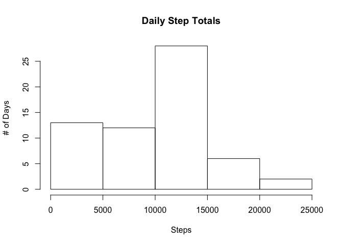
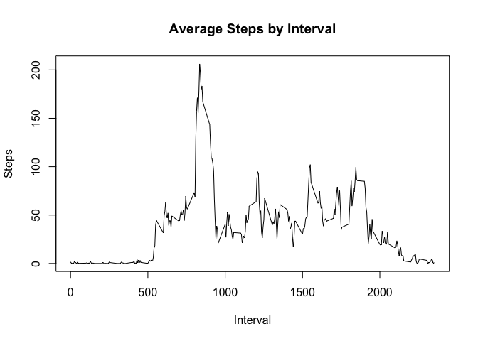
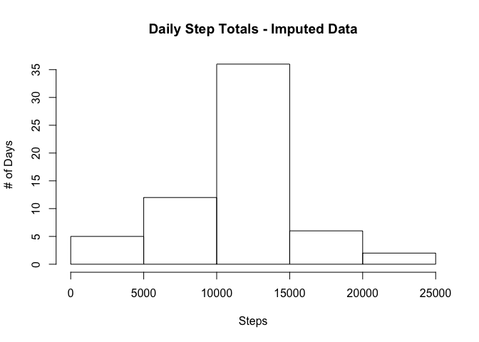
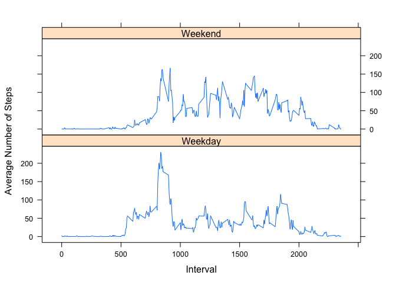

# PA1_template.Rmd


# Step Data Analysis

It is now possible to collect a large amount of data about personal movement using activity monitoring devices such as a Fitbit, Nike Fuelband, or Jawbone Up. These type of devices are part of the "quantified self" movement - a group of enthusiasts who take measurements about themselves regularly to improve their health, to find patterns in their behavior, or because they are tech geeks. But these data remain under-utilized both because the raw data are hard to obtain and there is a lack of statistical methods and software for processing and interpreting the data.

This assignment makes use of data from a personal activity monitoring device. This device collects data at 5 minute intervals through out the day. The data consists of two months of data from an anonymous individual collected during the months of October and November, 2012 and include the number of steps taken in 5 minute intervals each day.


```r
# read data table from current working directory
data_in <- read.csv("activity.csv")
data_in$date <- as_date(data_in$date)
#
```

##Calculate the total number of steps taken per day
What is mean total number of steps taken per day?

<!-- -->

Mean and median of total number of steps taken per day.

Mean: 9354.2295082

Median: 10395

##What is the average daily activity pattern?


```r
daily_data <- data_in %>% group_by(interval) %>% 
        summarize(avg_steps = mean(steps,na.rm = TRUE))
with(daily_data,plot(interval,avg_steps,type = "l",
                     main = "Average Steps by Interval",xlab="Interval",
                     ylab = "Steps"))
```

<!-- -->

```r
max_interval <- daily_data[which.max(daily_data$avg_steps),1]
```

Interval with maximum average daily step count is interval 835.

##Imputing missing values


```r
imputed_data <- data_in
incomplete <- sum(!complete.cases(data_in))
NAs <- is.na(data_in$steps)
interval_avg <- tapply(data_in$steps, data_in$interval, mean, na.rm=TRUE,
                       simplify=TRUE)
imputed_data$steps[NAs] <- interval_avg[as.character(data_in$interval[NAs])]
hist_imputed_data <- imputed_data %>% group_by(date) %>% 
        summarize(total_steps = sum(steps))
with(hist_imputed_data,hist(total_steps, 
                            main = "Daily Step Totals - Imputed Data",
                            xlab="Steps",ylab = "# of Days"))
```

<!-- -->

```r
median_imputed_steps <- format(median(hist_imputed_data$total_steps),
                               scientific = FALSE)
mean_imputed_steps <- format(mean(hist_imputed_data$total_steps),
                             scientific = FALSE)
```
In dataset activity.csv there are 2304 missing records

Mean and median of total number of steps taken per day using imputed data:

Mean: 10766.19

Median: 10766.19

Mean and median are now the same with the data imputed.

Comparing to non-imputed, first dataset: 

Mean: 9354.2295082

Median: 10395

Imputing missing data raised the mean and median steps taken compared to the first step.

##Are there differences in activity patterns between weekdays and weekends?


```r
Weekdays <- c("Monday","Tuesday","Wednesday","Thursday","Friday")
imputed_data$dow <- ifelse(weekdays(imputed_data$date) %in% Weekdays,"Weekday","Weekend")
weekend_data <- imputed_data %>% group_by(dow,interval) %>% 
        summarize(avg_steps = mean(steps))
xyplot(avg_steps ~ interval|dow, weekend_data, layout=c(1,2),type = "l", 
       xlab = "Interval", ylab = "Average Number of Steps")
```

<!-- -->
